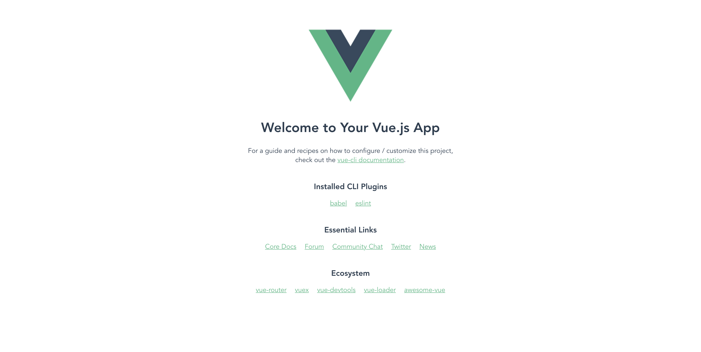
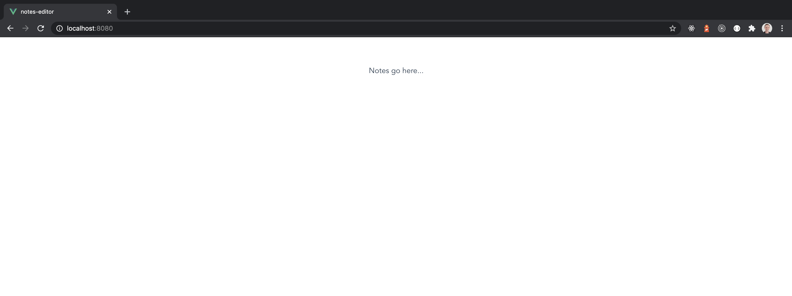
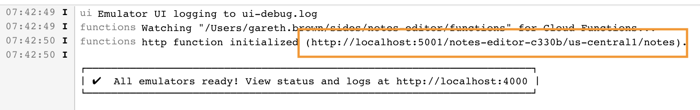

This is a part 2 of the [previous post for setting up Firebase Functions](../firebase-functions-notes). I thought it would be good to have a frontend for our API. I'm very new to Vue JS so I've chosen to use Vue mainly as a way to learn it further myself. I'm not going to explain in detail about which part of Vue js does what, rather I'm just going to show you how to implement it. There are loads of really good introductions and how-tos for Vue js if you want to look into it in more detail, I would recommend [Tania Rascia's overview and walkthrough](https://www.taniarascia.com/getting-started-with-vue/) (Vue 2). A good place to start is also the [Vue Introduction](https://vuejs.org/v2/guide/index.html). This is for Vue 2 but there's a drop down on the page where you can see the introduction for Vue 3.

## Installing Vue JS

First we need to install Vue in our project. Make sure you're a level up from the root of your project directory. The Vue CLI can be used to create a whole new Vue project but can also add Vue to an existing project, which is what we're going to do.

Run the following to install Vue into the current project folder, make sure the folder name matches exactly otherwise a new folder and project will be created. Select the 'Merge' option so that your project is not overwritten.
```
vue create notes-editor
```

I was given the option to select Vue 2 or Try Vue 3, I'm going to dive into Vue 3 which I'll use for the rest of this tutorial.

Once this is installed you're ready to go. You can see the default Vue app by running:

```
npm run serve
```



## Display the notes

The first section of UI we'll work on is displaying a list of all the notes we have saved. Create a directory named `components` and a file inside named `components/NotesList.vue`. We'll just add some placeholder text here for the moment.

### **`NotesList.vue`**
```html
<template>
  <p>Notes go here...</p>
</template>

<script>
export default {
  
}
</script>

<style scoped>

</style>
```

Then render this component in the main `App.vue` file by replacing the `HelloWorld.vue` component with your `NotesList.vue` component.
You can see that I've also deleted the default image.

### **`App.vue`**
```html
<template>
  <NotesList />
</template>

<script>
import NotesList from './components/NotesList.vue'

export default {
  name: 'App',
  components: {
    NotesList
  }
}
</script>

<style>
#app {
  font-family: Avenir, Helvetica, Arial, sans-serif;
  -webkit-font-smoothing: antialiased;
  -moz-osx-font-smoothing: grayscale;
  text-align: center;
  color: #2c3e50;
  margin-top: 60px;
}
</style>
```

Once you've done this just go ahead and delete the now redundant `HelloWorld.vue` file. If you reload the browser now you should see a white screen with the words 'Notes go here...'.



Now we'll hard code a list of notes in our component using the composition API by setting `notes` as a reactive variable. I'm primarily a React developer so if you're familiar with React then setting a variable using `ref()` is basically the same as component state in React. To render these notes to the UI we can use the Vue `v-for` directive which will loop through the array of notes and display each one.

### **`NotesList.vue`**
```html
<template>
  <h1>Notes</h1>
  <!-- Render the array of notes using v-for directive just like a for loop -->
  <div v-for="note in notes" v-bind:key="note.title">
    <h3>{{ note.title }}</h3>
    <p>{{ note.text }}</p>
  </div>
</template>

<script>
import { ref } from 'vue';

export default {
  // Using the composition API to set our component variables
  setup() {
    let notes = ref([
      { title: 'Shopping List', text: 'Tomatoes, Milk, Salt' },
      { title: 'Book', text: 'Name of the wind' },
      { title: 'Note', text: 'This is a note' },
    ]);
    
    return {
      notes,
    };
  }
}
</script>

<style scoped>

</style>
```

Modify the `App.vue` file to add a wrapper `div` with some minor styling so the notes are displayed nicely.

### **`App.vue`**
```html
<template>
  <div class="wrapper">
    <NotesList />
  </div>
</template>

<script>
import NotesList from './components/NotesList.vue'

export default {
  name: 'App',
  components: {
    NotesList
  }
}
</script>

<style>
#app {
  font-family: Avenir, Helvetica, Arial, sans-serif;
  -webkit-font-smoothing: antialiased;
  -moz-osx-font-smoothing: grayscale;
  color: #2c3e50;
  margin-top: 60px;
}

.wrapper {
  width: 40%;
  margin: auto;
  display: flex;
  flex-direction: column;
}
</style>

```

## Run Vue with Firebase emulator

To develop and test this locally we'll need to run Vue alongside the Firebase emulator so that Vue can make requests to our Firebase functions. At the moment even if you just try to run them separately they both try to run on port `8080` so you'll only be able to run one at a time. Let's fix this now.

Change the Firebase emulator to run on a different port, I had to change mine to port `8082`.

### **`firebase.json`**
```jsonc
{
  "functions": {
    "predeploy": [
      "npm --prefix \"$RESOURCE_DIR\" run lint"
    ],
    "source": "functions"
  },
  "firestore": {
    "rules": "firestore.rules",
    "indexes": "firestore.indexes.json"
  },
  // Add this to change the port number the Firebase emulator will run on
  "emulators": {
    "firestore": {
      "port": 8082
    }
  }
}
```

Then in the `scripts` section of your `package.json` file add the follow script to be ran using `npm start`.

### **`package.json`**
```jsonc
"scripts": {
  // Add the line below to run the Vue server and Firebase emulator concurrently
    "start": "npm run serve & firebase emulators:start --import=firestore_data",
    "serve": "vue-cli-service serve",
    "build": "vue-cli-service build",
    "lint": "vue-cli-service lint"
  },
```

Now try running Vue and the Firebase emulator concurrently in your terminal, run the following from the root of your project directory.

```
npm start
```

## Get notes from Firestore

In part 1 of this tutorial we added some notes to Firestore and created a Firebase function that would get the notes from Firestore and return them to us. If you go to your Firebase emulator logs tab (mine is at http://localhost:4000/logs) you'll see the endpoint for this get request.

.

We're going to setup our Vue app so that we populate the notes by getting them from this endpoint. It's common to use axios for this, so that's what we'll do. Install axios using the following:

```
npm install axios
```

Then in your `NotesList.vue` file change the script to request notes from your endpoint using axios. We'll do this in the `onMounted` lifecycle hook which is called when the component is mounted. Remember you can find your `notes` endpoint in the logs we discussed above.

### **`NotesList.vue`**
```html
<script>
import { ref, onMounted } from 'vue';
import axios from 'axios';

export default {
  // Using the composition API to set our component variables
  setup() {
    let notes = ref([]);

    onMounted(() => {
      // Your enpoint will be different to this so make sure to find it in your Firebase emulator logs
      axios
        .get('http://localhost:5001/notes-editor-c330b/us-central1/notes')
        .then((notesResult) => {
          notes.value = notesResult.data;
        });
    });
    
    return {
      notes,
    };
  }
}
</script>
```

Make sure your servers are running with `npm start` and reload your Vue app in the browser (http://localhost:8080/). At this point you will not see any notes and possibly wonder why! Well you just got CORS'd! Open the browser console and you'll see the following error:

```
Access to XMLHttpRequest at 'http://localhost:5001/notes-editor-c330b/us-central1/notes' from origin 'http://localhost:8080' has been blocked by CORS policy: No 'Access-Control-Allow-Origin' header is present on the requested resource.
```

This is becuase our Firebase function enpoint has not specified an `Access-Control-Allow-Origin` header indicating which client may call it. We'll need to modify the code in our function to allow our client to call it. This is relatively easy to do using the 'cors' package which should already be installed. In your `functions/notes.js` file import the cors package with `const cors = require('cors');` and bind the middleware to the app object using `app.use(cors({ origin: true }));` after the app has been created. The code should look something like this:

```js
// Import cors package
const cors = require('cors');

// Create express app
const app = express();

// Bind cors middleware to the app
app.use(cors({ origin: true }));

```

Now reload the browser and you should see notes displayed that are returned from Firestore.

## Add notes to Firestore

We want to be able to use the UI to write a note that is saved to our Firestore instance. Let's create a new Vue component for this named `components/CreateNote.vue`.

### **`CreateNote.vue`**
```html
<template>
  <h1>Add note</h1>
  <input v-model="noteTitle" />
  <textarea v-model="noteText"></textarea>
  <!-- This button triggers the addNote function -->
  <button @click="addNote">Add note</button>
</template>

<script>
import { ref } from 'vue';
import axios from 'axios';

export default {
  setup() {
    let noteTitle = ref('');
    let noteText = ref('');

    // This addNote function creates a post request that sends our note title and text to our cloud function
    // which will save it to Firestore. Make sure to enter your specific endpoint URL.
    function addNote() {
      axios.post('http://localhost:5001/notes-editor-c330b/us-central1/notes', {
        title: noteTitle.value,
        text: noteText.value,
      });
    }

    return {
      noteTitle,
      noteText,
      addNote,
    }
  }
}
</script>

<style scoped>
  input, textarea, button {
    font-family: inherit;
    margin: 10px 0;
  }

  button {
    width: 25%;
    margin-bottom: 50px;
  }
</style>
```

We've created a function named `addNote()` which will take the title and text of the note we enter in the text input and text area, then send it using a post request to our endpoint. You'll need to add your own endpoint URL.

Now render this new component inside `App.vue` like the following:

### **`App.vue`**
```html
<template>
  <div class="wrapper">
    <CreateNote />
    <NotesList />
  </div>
</template>

<script>
import NotesList from './components/NotesList.vue';
import CreateNote from './components/CreateNote';

export default {
  name: 'App',
  components: {
    NotesList,
    CreateNote,
  }
}
</script>
```

Now when you reload the browser you'll be able to enter a note title, note text and press the button which will save the details to your instance of Firestore. The only issue is you won't see anything has happened unless you check Firestore to verify that the note has been added. This is not a great user experience. Unfortunatley we've written this code in a way that makes this difficult because the logic for creating a note is in `CreateNotes.vue` and the logic for getting the notes is in `NotesList.vue` both of which contain their own state and are child nodes of `App.vue`. This makes it difficult for one component to know what the other component is doing.


## Refactor components

To fix this and make the whole app easier to work with we're going to move the state and logic up to the parent `App.vue` component, then we'll just send the state down to the child components as props. First add the required code to the `App.vue` component.

### **`App.vue`**
```html
<template>
  <div class="wrapper">
    <CreateNote
      v-bind:noteTitle="noteTitle"
      v-bind:noteText="noteText"
      v-on:update-notetext="updateNoteText"
      v-on:update-notetitle="updateNoteTitle"
      v-on:add-note="addNote"
    />
    <NotesList v-bind:notes="notes" />
  </div>
</template>

<script>
import NotesList from './components/NotesList.vue';
import CreateNote from './components/CreateNote';
import { ref, onMounted } from 'vue';
import axios from 'axios';

export default {
  name: 'App',
  components: {
    NotesList,
    CreateNote,
  },
  setup() {
    let notes = ref([]);
    let noteTitle = ref('');
    let noteText = ref('');

    onMounted(() => {
      fetchNotes();
    });

    // This addNote function creates a post request that sends our note title and text to our cloud function
    // which will save it to Firestore
    function addNote() {
      axios.post('http://localhost:5001/notes-editor-c330b/us-central1/notes', {
        title: noteTitle.value,
        text: noteText.value,
      }).then(() => {
        // Get the updated notes once we've added a new one
        fetchNotes();
      });
    }

    // This fetchNotes function will get the notes from the get endpoint when called
    function fetchNotes() {
      axios
        .get('http://localhost:5001/notes-editor-c330b/us-central1/notes')
        .then((notesResult) => {
          notes.value = notesResult.data;
        });
    }

    function updateNoteText(text) {
      noteText.value = text;
    }

    function updateNoteTitle(title) {
      noteTitle.value = title;
    }
    
    return {
      notes,
      noteTitle,
      noteText,
      addNote,
      updateNoteText,
      updateNoteTitle,
    };
  }
}
</script>
```

There's quite a lot more happening here but the key new additions are as follows:

* All note state is now managed from the parent component `App.vue`.

```js
let notes = ref([]);
let noteTitle = ref('');
let noteText = ref('');
```

* Then the `notes` state is passed to the `NoteList.vue` component while the `noteTitle` and `noteText` state is passed to the `CreateNote.vue` component using `v-bind`. The child components will receive these values as props.

* The `App.vue` component will respond to changes made to these values from the `v-on:update-notetext` and `v-on:update-notetitle` event handles, which will call the `updateNoteText(text)` and `updateNoteTitle(title)` functions respectively.

```html
<template>
  <div class="wrapper">
    <CreateNote
      v-bind:noteTitle="noteTitle"
      v-bind:noteText="noteText"
      v-on:update-notetext="updateNoteText"
      v-on:update-notetitle="updateNoteTitle"
      v-on:add-note="addNote"
    />
    <NotesList v-bind:notes="notes" />
  </div>
</template>
```

* The `App.vue` component now handles the api requests for `fetchNotes()` and `addNote()`
* `fetchNotes()` is first called when the component mounts using `onMounted` and then everytime a new note is added.
```js
onMounted(() => {
  fetchNotes();
});
```

```js
.then(() => {
  // Get the updated notes once we've added a new one
  fetchNotes();
});
```

The change for the two child components `CreateNote.vue` and `NotesList.vue` are mainly to remove the functionality we've now added to the parent `App.vue` component and make sure they receive the props passed to them correctly.

### **`CreateNote.vue`**
```html
<template>
  <h1>Add note</h1>
  <input
    v-bind:value="noteTitle"
    v-on:input="$emit('update-notetitle', $event.target.value)"
  />
  <textarea
    v-bind:value="noteText"
    v-on:input="$emit('update-notetext', $event.target.value)"
  />
  <!-- This button triggers the addNote function -->
  <button v-on:click="$emit('add-note')">Add note</button>
</template>

<script>
export default {
  props: {
    noteTitle: String,
    noteText: String,
  }
}
</script>
```

The key change for the `CreateNote.vue` component above is that we bind the `noteTitle` prop to the `<input>` and the `noteText` prop to the `<textarea>` then emit an event everytime the user changes the values or types another letter using `v-on:input`. We also emit an event named `add-note` when the button is clicked, which is handled in the `App.vue` component.

The `NotesList.vue` component now only recieves the `notes` array as a prop passed down from `App.vue` rather than fetching the notes and applying to its own local state. The `<template>` does not change at all.

### **`NotesList.vue`**
```html
<script>
export default {
  props: {
    notes: Array,
  },
}
</script>
```

Once you've made these changes refresh the browser and add another note, you should see it be automatically added to the notes list in the UI.

## Conclusion

You've now successfully created a web app using Vue on the frontend and Firebase Cloud functions on the back end. This tutorial should give you a good starting point to implement more functionality using these tools and create your own web app. If you would like to learn more about Firebase then you can have a look at my [Building Web Applications with Firebase](https://www.manning.com/livevideo/building-web-applications-with-firebase) course online at Manning.


