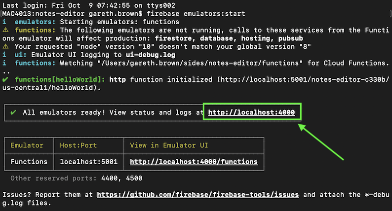

I've been a big fan of Firebase for a while and have now used it in a number of project. I've even put together a [video course about it with Manning](https://www.manning.com/livevideo/building-web-applications-with-firebase)

However it's only recently that I've started to use Firebase Cloud Functions. A way to easily develop and deploy cloud functions on the Firebase platform with seemless integration into other Firebase services such as Firestore and the Firebase Local Emulator Suite.

In this tutorial blog post I want to create an API endpoint using Cloud Funcitons where we can create and get notes from Firestore. We'll also develop this functionality using the Firebase Local Emulator Suite.

I'm going to assume some basic knowledge of Firebase here but with some reference to Firebase docs you'll still be able to follow this post. I'm just not going to go into details about all the Firebase concepts covered.

### Create a Firebase Project

Add a new project from the [Firebase Console](https://console.firebase.google.com/) and give it a name. I've call mine Notes Editor.


There'll be a question about Google Analytics, whether you decide to add it or not is up to you. Then click to create your project.

Now that the project is setup we won't need to refer to the Firebase console very much for the rest of this post.

### Node and Firebase CLI

You will need to make sure Node is installed and also the [Firebase CLI](https://firebase.google.com/docs/cli?#setup_update_cli). If node is aready installed you can install the Firebase CLI with `npm install -g firebase-tools`.

Once Firebase CLI is installed make sure you are logged in using `firebase login`. This is so the CLI knows who Firebase account you actually want the CLI to interact with.

### Create the project

Start by creating a directory to house your project with `mkdir notes-editor` then navigate to it with `cd notes-editor`.

Now that we're in the project directories root we can initialise this as a Firebase project. Use the Firebase CLI to do this by running:

```
firebase init functions
```
You'll be asked a few questions. First we need to specify which Firebase project we want to associate with the project we're initialising. Select the option to **Use an existing project** and then choose the project you've just created in the Firebase console named Notes Editor. You'll just see the Project ID which for me reads as `notes-editor-c330b`.

Next you'll be asked what language you want to use, either JavaScript or TypeScript. I'm going to keep it simple and select JavaScript. I've also selected to use ESLint and specified that I **want to install dependencies with npm now**. Otherwise you'll have to install them later with `npm install` anyway.

Now we wait while Firebase CLI does its thing and NPM dependencies get installed. Once completed you should see a message indicating that Firebase initilization is complete.


Spend a few minutes having a look at the files and directories that have been created. I won't go over the details of what each do but you should note that you now have a `/functions` folder. This is where all your cloud function code is going to live.

I do want to draw your attention to one detail in the `package.json` file inside the functions directory. You will see that the node version is set to 10.
```
"engines": {
  "node": "10"
},
```

This is the recommended version and will all work fine, unless you want to deploy your functions to Firebase using the free Spark plan. The free Spark plan only support Node 8, which was deprecated on June 8th 2020. Firebase will halt execution of these function after March 15, 2021. It's hard to know what will happen regarding running Cloud Functions on Firebase using the free Spark plan but you might need to bite the bullet and upgrade to the pay as you go Blaze plan.

We'll leave this as Node 10 for now as we're only going to be running this locally using the Firebase Local Emulator Suite.


### Running functions locally

If you have a look at `/functions/index.js` you'll see that there's already a `helloWorld` function for us to use that's commented out. Uncomment the function so we can run it and see what happens.
```js
const functions = require('firebase-functions');

// Create and Deploy Your First Cloud Functions
// https://firebase.google.com/docs/functions/write-firebase-functions

exports.helloWorld = functions.https.onRequest((request, response) => {
  functions.logger.info("Hello logs!", {structuredData: true});
  response.send("Hello from Firebase!");
});
```

We can now try this by running Emulator Suite using the Firebase CLI from the root of our project directory.

```
firebase emulators:start
```

You can see the URL of the Emulator Suite dashboard in the console. Mine is running at http://localhost:4000 so I'll open this in my browswer.



Once it's running navigate to the URL and you should be on the Emulator's overview page.


Navigate to the Logs tab, this will give you the output you need to find out where your functions are running and the URL to send your http request to. You can see below that the hello world function for me is running at http://localhost:5001/notes-editor-c330b/us-central1/helloWorld.


As this is a get request you can just paste the URL in your browser and you'll see the respone.


Woo hoo! Looks like that worked perfectly :)

### Firestore Setup

We're going to start with writing a get request, except that we have no data to get! So initially we're just going to manually add data to the database that we can retrieve. Later we'll add this using another function.

We don't have Firestore initialised yet so let's do that now. Stop the Firebase emulator if it is running and in the root of your project run:
```
firebase init firestore
```

You'll most likely see the following output indicating that you need to setup Firestore in your Firebase project.


Fortunately is tells you the URL you can paste into your browser to set up Firestore. The link for my project is https://console.firebase.google.com/project/notes-editor-c330b/firestore. Yours will be similar. Once you paste this link into the browser you will land on the the Firestore tab of you Firebase project. Click the "Create database" button circled below in blue.


You'll be asked to set your initial security rules, for this sake of simplicity just set this to test mode. You can find out more about [Firestore security rules](https://firebase.google.com/docs/firestore/security/get-started) but all you need to know here is that if you put this project live then everyone will have read and write access to your database so don't do that until you've got your security rules covered. I also talk about the security rules in [my Firebase video course](https://www.manning.com/livevideo/building-web-applications-with-firebase)).

Next set the location that's closest to you and click "Enable".

Once Firestore is setup in your project you can run `firebase init firestore`, select all the defaults for questions about which files to use for security rules and indexes. Now that Firestore has been initialised, we will be able to access this in the Firebase emulator. Start up the emulator again with `firebase emulators:start`.

Once the emulator has started navigate to the emulator dashboard in your browser and click on the Firestore tab. You should see an empty database similar to this:


Lets manually add some data that we can retrieve with our get request...

Click the "Start collection" button and create a collection with a collection ID of `notes`.


Click "Next" and you'll be give the option to add fields to the [first document of this collection](https://firebase.google.com/docs/firestore/data-model). Create three fields labelled "created", "title", and "text". The "created" fields will be a time stamp, "title" and "text" will just be strings. Add some values to these fields, you can see how I've populated them below. Click "Save" once you're done.


You should now be able to see your new notes collection and document in your Firestore instance.


I'm going to add two more notes so I've got a few more, you can add some more yourself by clicking the "Add document" button in the notes collection column. Make sure your notes document have the exact same fields of `created`, `title` and `text`. Once these are added we can start to write our get request function.

---
**NOTE:**

I'm not sure why but when I first create a new document and click save, my Firestore only shows the notes collection in a single large column. I can't see my documents even when I click on `notes`. This was resolved easily enough just by refreshing the browser.


---

### Persisting Firestore data in emulator

Before you stop the emulator you should be aware that the data you've just added will not persist, so the next time you fire up the emulator it will be gone!

However while the emulator is still running you can export the data to a specified directory. Let's export the notes data to a directory named firestore_data by running:
```
firebase emulators:export firestore_data
```

You can now safely stop the emulator. Next time you fire up the emulator you can use the following to import the firestore data from the firestore_data directory:
```
firebase emulators:start --import=firestore_data
```

You can then use different data directories for different data sets if required.

### Get request

We're going to use Express to handle our requests, so install this first. Make sure you're in the `/functions` directory as this is where we'll manage the packages for our cloud functions. Later we may want to setup a front end to consume the endpoints, which we want to keep separate from the cloud functions.

Install Express inside `/notes-editor/functions` directory with:

```
npm install --save express
```

Now create a new file named `notes.js` inside `/notes-editor/functions` and add the following code:

**notes.js**
```js
const functions = require('firebase-functions');
const express = require('express');
const admin = require('firebase-admin');

// Create Express app
const app = express();

// Initialize Firebase admin to access Firestore from the server
admin.initializeApp();

app.get('/', async (request, response) => {
  functions.logger.info('Triggering get notes request', { structuredData: true });

  try {
    // Use admin to access a reference to the notes collection in Firestore
    const notesRef = admin.firestore().collection('notes');
  
    // Get all notes from the notes collection in descending order of 'created' field
    const notesCollection = await notesRef.orderBy('created', 'desc').get();
  
    // Add notes document data to an array
    let notes = [];
    notesCollection.forEach((note) => {
      notes.push(note.data());
    });
  
    // return notes array as a json response
    response.json(notes);
  } catch (error) {
    // Log and return error status if things go wrong
    functions.logger.error(error);
    response.status(500).send('Internal server error');
  }
});

exports.notes = functions.https.onRequest(app);
```

I've added comments to the code to give a brief explanation of what's happing. You can see we've imported Express to manage the request and also the [Firebase admin SDK](https://firebase.google.com/docs/database/admin/start), which we use to access the Firestore API by calling `admin.firestore()`. We then get a reference to the `notes` collection and asynchronously call the `get()` method to return the notes. We add the note data from each document to an array and return the array in json format.

Now open up the `index.js` file which contains our 'hello world' function. Delete all the current code and use this file to import and export our `notes.js` file.

**index.js**
```js
const notes = require('./notes');

exports.notes = notes.notes;
```

Call your function in the browser again, remember you can find the URL in the firebase emulator logs tab. When I call this get request it returns the following json data.
```json
[
  {
    "created": {
      "_seconds": 1602570624,
      "_nanoseconds": 649000000
    },
    "title": "My First Note",
    "text": "This is the text of my first note."
  },
  {
    "created": {
      "_seconds": 1602571345,
      "_nanoseconds": 317000000
    },
    "title": "To do",
    "text": "Finish this tutorial."
  },
  {
    "created": {
      "_seconds": 1602571432,
      "_nanoseconds": 222000000
    },
    "title": "Exercise",
    "text": "Rock climbing on Friday."
  }
]
```
We've now successfully returned the data stored in Firestore using a Firebase Cloud Function, well done! Now let's write a function that will add a new notes to Firestore using a post request.


### Post request

Directly underneath our get request we're going to create a post request to the same endpoint, which will allow us to save notes to Firestore.

```js

app.post('/', async (request, response) => {
  functions.logger.info('Triggering post note request', { structuredData: true });
  
  // Construct the note object to add to Firestore
  const note = { 
    created: admin.firestore.Timestamp.now(),
    title: request.body.title,
    text: request.body.text, 
  }

  try {
    // Save the note to the Firestore notes collection
    await admin.firestore().collection('notes').add(note);
    response.json({ message: 'Note added successfully'});
  } catch (error) {
    // Log and return error status if things go wrong
    functions.logger.error(error);
    response.status(500).send('Internal server error');
  }
});
```

We've used the Firestore `Timestamp` class to get the created time in the Firestore timestamp format. The title and text come straight from the body of the request, which will need to look like this:
```json
{
    "title": "Title goes here",
    "text": "Text for your note goes here"
}
```

To try this now you won't be able to use the browser becuase it is a get request, you'll need to use a tool like [Postman](https://www.postman.com/) or curl.

The URL will be the same as your get request but you'll need to specify in Postman that it's a post request. My Postman setup for this request looks like this:


Once you've successfully added a note your response should indicate this with:
```json
{
    "message": "Note added successfully"
}
```

### Deploying functions to live

We've now create a post request to save a note to Firestore and a get request to get all our notes from Firestore. It's time for us to deploy to live. It's important again though to point out that we have not implemented anykind of authentication here so when it's live anyone can add notes to your projects instance of Firestore. But for the purpose of this tutorial and learning the process we're going to be ok with that for now.

If you're using the free Spark plan you'll need to change the node version to 8, although as discussed earlier in this tutorial this is deprecated and will be decommissioned on 2021-03-15.

In your `/functions/package.json` file make sure node is set to version 8:
```json
"engines": {
  "node": "8"
}
```

If you try to deploy your functions on the free Spark plan with the node version set to 10 then you'll see the following error:
```
Error: HTTP Error: 400, Billing account for project '3012########' is not found. Billing must be enabled for activation of service(s) 'cloudbuild.googleapis.com,containerregistry.googleapis.com' to proceed.
```

Once you've changed your node version to 8 then you can deploy your functions to live using:

```
firebase deploy --only functions
```

When I first tried this I got the following unhelpful error:
```
Error: HTTP Error: 403, Unknown Error
```

This is resolved by logging into your Firebase console, clicking on the 'functions' menu link and clicking 'Get started'. You'll be shown a couple of steps about how the setup Functions in your project, but we've already gone through these so you can ignore them.


Now try deploying your function again with `firebase deploy --only functions`. Once deployed successfully you should see something like the following:


You can see I've highlighted the endpoint URL to access your function. You can now use this in Postman to add some notes to your live instance of Firestore. You can see your notes added to Firestore from your Firebase project console, as seen below:


Ok that concludes this tutorial and should be enough to get you started using Firebase Cloud Functions. I've put some references below that I found very helpful and that I referenced throughout this tutorial. I recommend that you have a look.

## Next step

If you're only interested in Firebase Cloud Functions you can probably stop here but I've also put together a part 2. The next tutorial will go through how to implement a frontend using Vue 3 that will interact with the endpoints you've just created. [Adding Vue frontend to Firebase Functions API - Part 2](../firebase-functions-2-vue).


### References

Here's some links to documentations that I've used and reference material for this post. I'd recommend you looking at them if you want to know more about the Firebase concepts I've discussed in this post.

[Building Web Applications with Firebase](https://www.manning.com/livevideo/building-web-applications-with-firebase)

I've developed this video course with Manning. The focus is on getting developers brand new to Firebase up and running quickly to build web apps using Firebase services such as Hosting, Firestore, Cloud Storage and Authentication.

[Get started with Cloud Functions](https://firebase.google.com/docs/functions/get-started)

This is the first place I would go to as a starting point for Firebase Cloud Functions and was referenced heavily for the initial setup phase of this post.


[Understand Firebase Projects](https://firebase.google.com/docs/projects/learn-more)

A great reference for what a Firebase project is and how it relates to projects on the Google Cloud Platform. Namely that they are the **same thing!**

[Firebase CLI](https://firebase.google.com/docs/cli?#setup_update_cli)

The CLI you need for all things Firebase.

[Firestore security rules](https://firebase.google.com/docs/firestore/security/get-started)

An important concept to know if your going to use Firebase for a live web app. Do not put anything live without understanding this first!

[Firebase Firestore](https://firebase.google.com/docs/firestore)

You can learn more about Firestore and how it works here.


