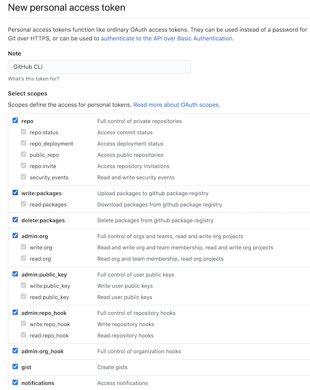

I've seen this new GitHub CLI pop up recently in articles and as I use GitHub for both projects at work and home it makes complete sense for me to check it out. Hopefully you'll find my notes below useful for when you dive in yourself!

I'm mainly following the guides from the [official GitHub CLI page](https://cli.github.com/), there also a [youtube intro video](https://youtu.be/vcAIZ4axYZU) you can watch.

### Installing GitHub CLI

Not much to it really:
```
brew install gh
```

### Authenticating

GitHub CLI needs to know who you are and which repo to connect to. You can kick that process off with the following:
```
gh auth login
```

You'll first get asked a few questions. There are the answers I gave, but your preferences may be different.

**What account do you want to log into?**
A: GitHub.com

**How would you like to authenticate?**
A: Paste an authentication token

You'll then be given a url where you can create a token so the GitHub CLI can access your account. https://github.com/settings/tokens.

Click "generate new token" and you'll be asked to add a note. This note is to let you know what the token is for when you need to look at your tokens later. I've just added a note reading "GitHub CLI". 

You'll then need to select scopes depending on what access you want this token to have. As it's my personal account and I want to be able to do everything possible with the GitHub CLI I've just selected everything.



Click the green "generate token" button down the bottom of the page.

Then you'll see your token, make sure to copy it now as once you close the tab it will be gone forever! You'll have to then delete it and regenerate a new token.

Return to the command line and paste the token into the GitHub CLI setup.

**Choose default git protocol**
A: SSH

You should then see a message indicating that you have `Configured git protocol` and who you're logged in as.


### CLI commands

I'll probably update the following section as I use this CLI tool. I'm planning on using it overtime to see how I find it. To find out more info about what the GitHub CLI can do I would recommend [reading the docs](https://cli.github.com/manual/).

**Creating a pull request**

Make sure you're on the branch you want to create a pull request for and run:

```
gh pr create
```

You will be asked a series of questions about the details of your pull request:

Title? - Title of the PR

Body? - Body description of the PR. This can be opened in nano by pressing 'e' or skipped with 'enter'

Then you're given the option to submit your PR. Once submitted you're given the link that will take you directly to the PR in GitHub.

This will create a PR into your default branch, if you want the PR into another branch you can add the `--base` flag. If I wanted the PR to go into my develop branch for example I could use:
```
gh pr create --base develop
```

Now that our PR exists let's pretend that someone has reviewed it and found it to be of the highest coding standard they've ever seen. So it's time to merge. This can be done directly from the CLI with either the PR number, URL or branch name.

To display a list of your current PRs enter:

```
gh pr list
```

Then once you have the number for the PR you want to merge you can do this with:

```
gh pr merge 18
```

This will give you a few options of how you would like to merge such as `Create a merge commit`, `Rebase and merge` or `Squash and merge`. I'm going to pick the first option to create a merge commit. You'll also be given the option to delete both the local and remote branches, which I really like becuase I'm terrible at remembering to delete branches I don't need anymore.

To run the command without having to answer these questions you can also use the flags `--merge` and `--delete-branch` or using the single character flags together:

```
gh pr merge 18 -md
```

---
**Note**
If you get a message indicating that **Pull request #18 (Github CLI) can't be merged right now; try again in a few seconds** then it may be because some kind of CI is still running or there's another reason you can't merge yet such as requiring more reviews etc...
---